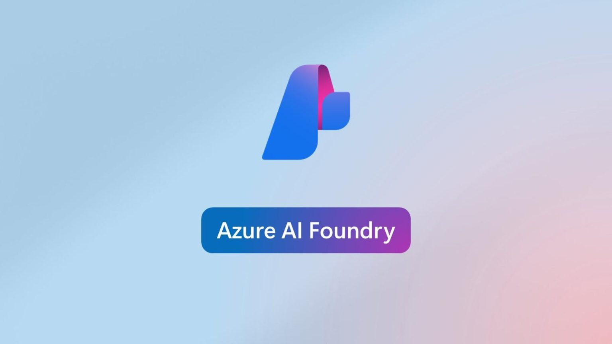
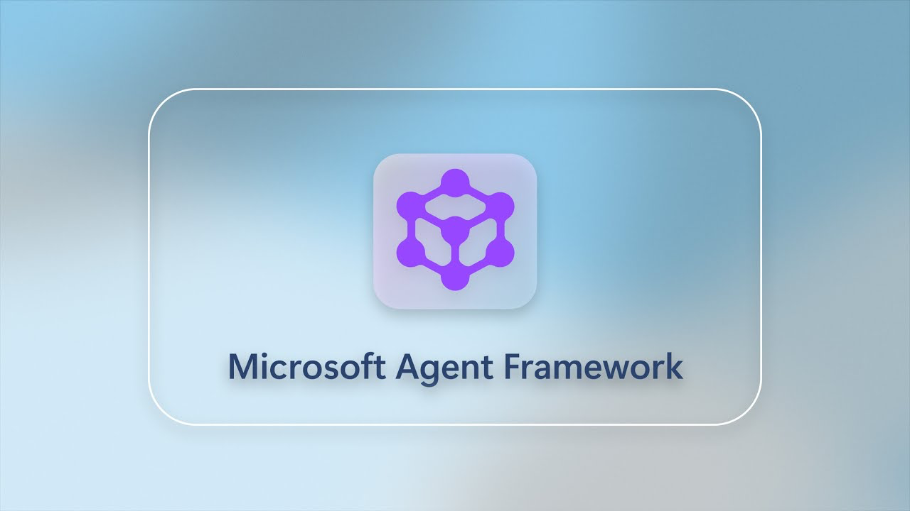

# 🚀 Develop AI Agents & multi-agent in Azure

  
  

Experimenting, building, evaluating, and
deploying **AI Agents** using **Azure AI Foundry**, the **Microsoft
Agent Framework**, and serverless Azure components.

## Technologies & Services

-   **Azure AI Foundry**
-   **Microsoft Agent Framework**
-   **Azure Functions** (serverless orchestration)
-   **Azure Blob Storage** (persistent storage)
-   **Azure Queue Storage** (event-driven workflows)

## Project Goals

-   Explore agents & multi-agent architectures on Azure
-   Prototype tools, actions, and agent capabilities
-   Experiment with cloud integrations (Functions, Queues, Blobs,
    APIM...)
-   Build reusable components and patterns for future agent projects

## Progress Status

**Status:** *Experimenting & Prototyping*\
This repository evolves as ideas, tests, and architectural spikes
progress.

